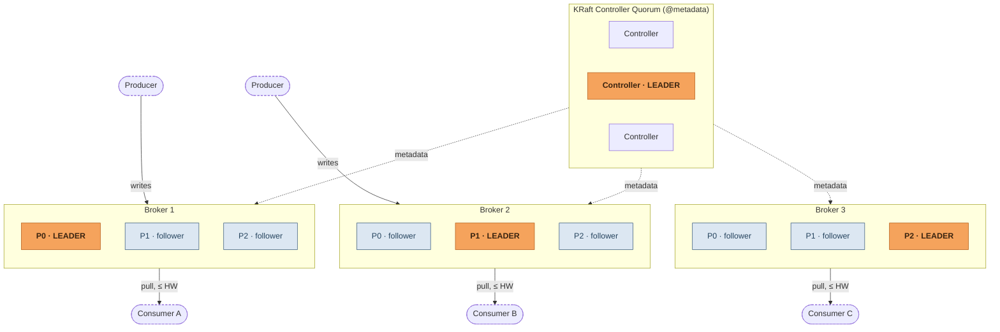
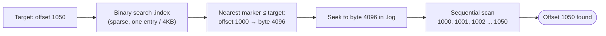
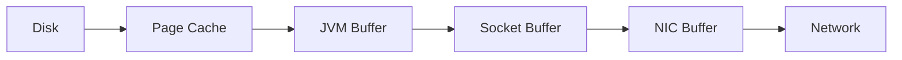
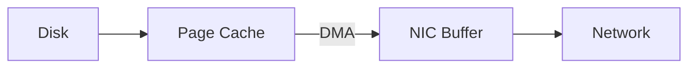
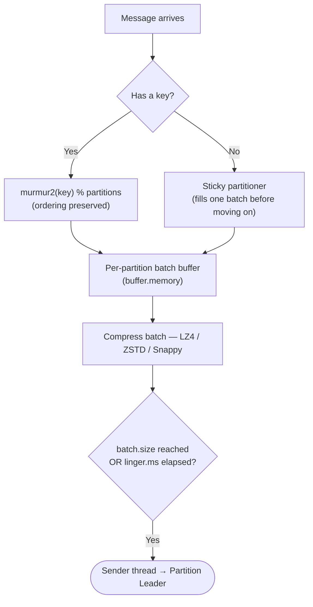
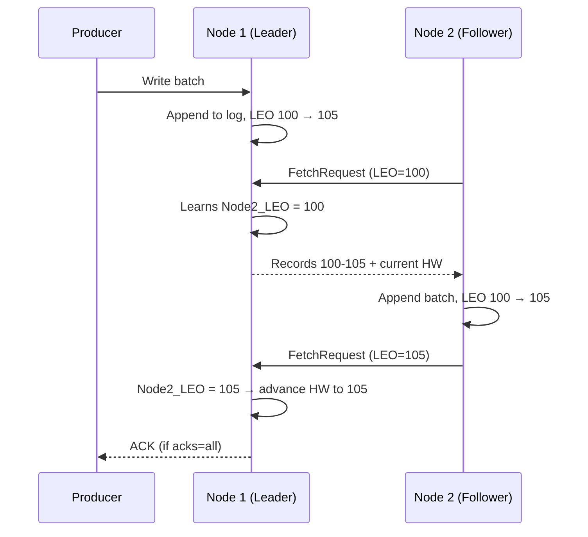
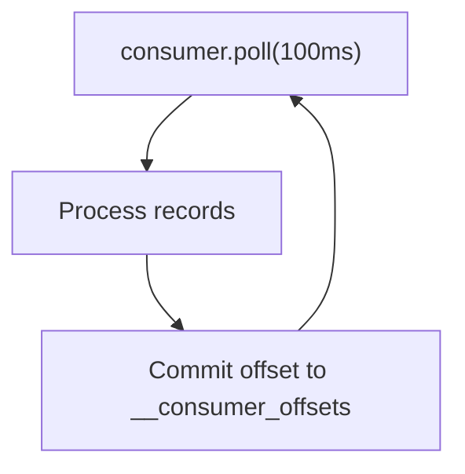

# Kafka Internals — Diagrams

Companion diagrams to `Kafka Internals - Notes.md`, in Mermaid so they render directly in Markdown-aware tools (GitHub, VS Code + Mermaid extension, Obsidian, Claude). If your viewer doesn't render Mermaid, each block below is still readable as plain text.

---

## Fig. 1 — Cluster topology (3 brokers, 3 partitions, replication factor 3)

Leadership is per **partition**, not per broker — each broker leads one partition and follows the other two. KRaft controllers run a separate metadata quorum alongside the data plane.

---

## Fig. 2 — Partition storage & the sparse index

A segment directory holds `.log`, `.index`, `.timeindex`, and `leader-epoch-checkpoint`. The `.index` file only records a position every 4 KB (`log.index.interval.bytes`), so reading offset **1050** means a binary search to the nearest marker, then a short sequential scan.

| Offset | Byte position |
|---|---|
| 0 | 0 |
| 1000 | 4096 |
| 2000 | 8192 |

---

## Fig. 3 — Serving a read: traditional copy vs. zero-copy

Kafka serves consumer fetches with the Linux `sendfile()` syscall, moving bytes from page cache straight to the NIC via DMA — skipping the JVM entirely.

**Traditional file transfer — 3 CPU copies, 4 context switches**

**Kafka `sendfile()` zero-copy — 0 CPU copies, 2 context switches**

---

## Fig. 4 — Producer pipeline: partition, batch, dispatch

A message is routed, buffered into a per-partition batch, compressed, then flushed to the leader once either threshold trips.

---

## Fig. 5 — Replication: the pull-based fetch cycle

Followers pull from the leader like ordinary consumers. The leader learns a follower's progress from the fetch request itself, then advances the High Watermark once the whole ISR has caught up.

---

## Fig. 6 — Consumer group: poll loop & partition assignment

Each partition is owned by exactly one consumer in a group. A consumer dropping out or joining triggers a rebalance of ownership across the rest.

**Topic: 4 partitions · Group: 4 consumers**

| Partition | Assigned consumer |
|---|---|
| P0 | Consumer A |
| P1 | Consumer B |
| P2 | Consumer C |
| P3 | Consumer D |

If Consumer C drops out, the group coordinator reassigns P2 to a remaining consumer — cooperative incremental rebalancing (`CooperativeStickyAssignor`) revokes only the affected partition, not the whole group.
